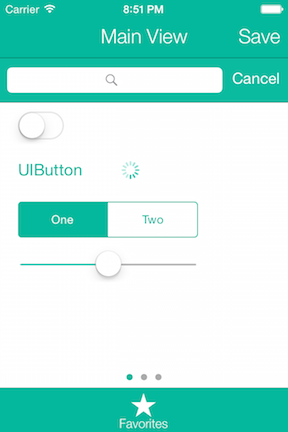
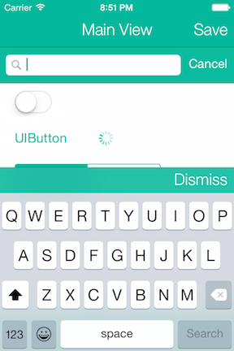

MAThemeKit
==================

MAThemeKit provides iOS developers the ability to create a coherent color theme throughout their entire application using a single line of code, removing the need to mess with the dozens of UIAppearance proxies for each UI component.


Usage
=====

Drop the MAThemeKit.h/m files into your project, import the header into your AppDelegate.m file, and in the application:didFinishLaunchingWithOptions: method tell MAThemeKit what you'd like your primary and secondary theme colors to be, what you want for a font for your applications Navigation/TabBar's and if you'd like the status bar to be light or not. (NOTE - you'll still need to manually add the 'View controller-based status bar appearance' key to your Info.plist and set it to NO for the status bar to be set to light content.)

In one simple line of code, your entire application will be set to your new beautiful theme!


```js
[MAThemeKit setupThemeWithPrimaryColor:[MAThemeKit colorWithR:0 G:184 B:156] secondaryColor:[UIColor whiteColor] fontName:@"HelveticaNeue-Light" lightStatusBar:YES];
```





There are two convenience methods provided by MAThemeKit to create UIColor objects from the RGB values or hex strings, for quick and easy creation of color information you might get from photoshop's color picker.

```js
// Use the rgb values BEFORE they are divided by 255.0, like you would see in photoshop's color picker
UIColor *colorWithRGB = [MAThemeKit colorWithR:0 G:184 B:156]

// Use the normal hex string representing the color
UIColor *colorWithHex = [MAThemeKit colorWithHexString:@"00b89c"];
```


Community
=====

Questions, comments, issues, and pull requests welcomed!!

License
=====

This project is made available under the MIT license. See LICENSE.txt for details.
